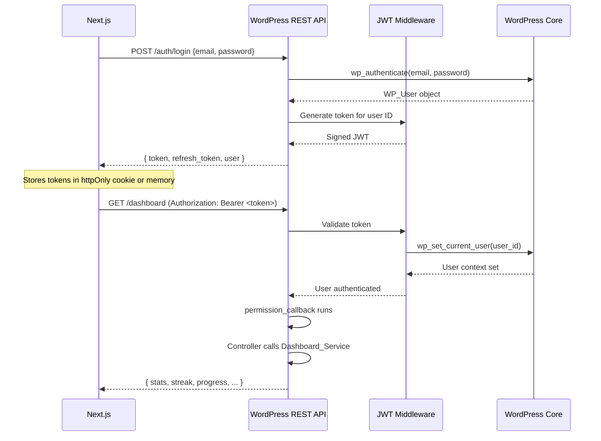
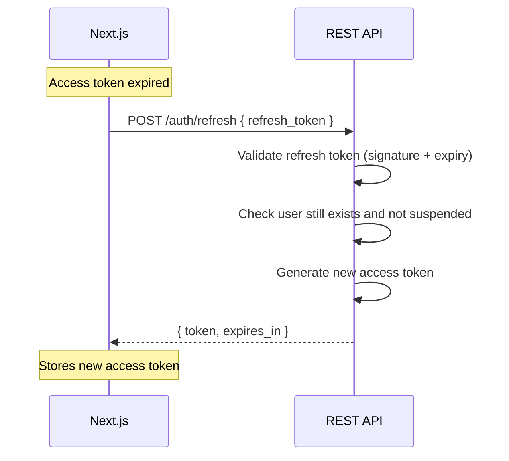
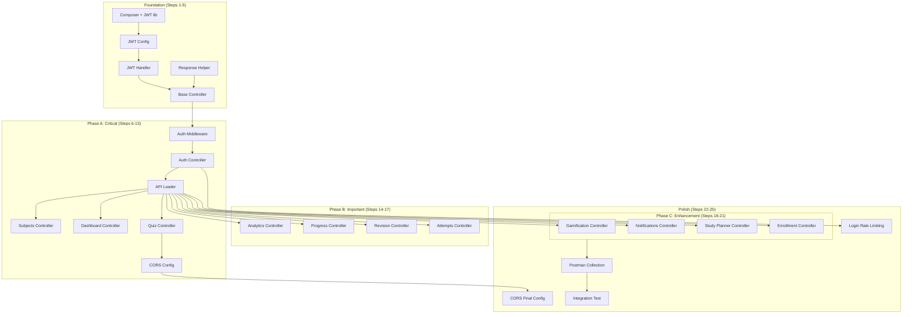

# API Implementation Plan

> [!IMPORTANT]
> This document is the complete technical roadmap for adding a REST API layer to the MDCAT Platform plugin. **No code changes are proposed here** — this is a pure implementation plan. The API will be built as thin REST controllers wrapping the existing service layer, with zero modifications to business logic.

---

## 1. API Architecture

### 1.1 Route Structure

All endpoints live under the WordPress REST API namespace:

```
/wp-json/mdcat/v1/
```

Route segments use **kebab-case** nouns. Resource IDs use path parameters. Actions use HTTP verbs (not URL verbs).

```
GET    /wp-json/mdcat/v1/subjects                    → list
GET    /wp-json/mdcat/v1/subjects/3                   → single
GET    /wp-json/mdcat/v1/subjects/3/chapters          → nested list
POST   /wp-json/mdcat/v1/quiz/start                   → action
POST   /wp-json/mdcat/v1/quiz/42/answer               → action on resource
POST   /wp-json/mdcat/v1/notifications/15/read        → action on resource
```

**Why `mdcat/v1`?**
- `mdcat` — avoids collision with other plugins
- `v1` — allows breaking changes via `/v2/` in the future without invalidating existing clients

---

### 1.2 Namespace Strategy

| Namespace | Purpose | Example Route |
|-----------|---------|--------------|
| `mdcat/v1` | All student-facing + public endpoints | `/wp-json/mdcat/v1/dashboard` |

All endpoints share a single namespace. There is no separate admin namespace — admin endpoints (enrollment management, reports, student management) remain in the WordPress admin via existing AJAX. The Next.js frontend only serves the student experience.

> [!NOTE]
> If a Next.js admin panel is needed in the future, add an `mdcat-admin/v1` namespace at that time. This plan does not cover admin API endpoints.

---

### 1.3 Controller Architecture

Every controller follows the same pattern as the existing AJAX handlers but uses `register_rest_route()` instead of `add_action('wp_ajax_*')`.

**Design Rules:**

1. Controllers are **static classes** — matching the existing plugin convention
2. Controllers **never contain business logic** — they only call services
3. Controllers **never write SQL** — all database access is via services
4. Controllers **always return** `WP_REST_Response` objects — never `wp_send_json_*`
5. Each controller class maps to exactly one REST resource group

**Controller lifecycle:**

```
Incoming Request
    → WordPress REST API router
    → permission_callback (auth + access check)
    → Controller method
        → Validate/sanitize input from $request
        → Call existing Service::method()
        → Format response via MDCAT_Platform_REST_Response
    → WP_REST_Response returned to client
```

**Naming Convention:**

```
MDCAT_Platform_REST_{Resource}_Controller

Examples:
  MDCAT_Platform_REST_Auth_Controller
  MDCAT_Platform_REST_Quiz_Controller
  MDCAT_Platform_REST_Dashboard_Controller
  MDCAT_Platform_REST_Subjects_Controller
```

---

### 1.4 Authentication Architecture

**Transport:** `Authorization: Bearer <JWT_TOKEN>` header on every authenticated request.

**Flow:**



**Why JWT over Application Passwords?**
- Application Passwords require the user to copy a complex string from WP admin — not viable for student-facing login forms
- JWT allows standard email/password login via the API itself
- JWT tokens can carry expiry and refresh semantics
- JWT works with Vercel/CDN edge caching (stateless)

---

### 1.5 Permission Callbacks

Every route registration includes a `permission_callback`. This replaces the `verify_request()` pattern in existing AJAX handlers.

**Permission levels:**

| Level | Callback | Used By |
|-------|----------|---------|
| **Public** | `__return_true` | Subjects, chapters, collections, enrollment submit |
| **Authenticated Student** | `check_student_access()` | Dashboard, quiz, analytics, progress, gamification, notifications, study planner |
| **Authenticated + Resource Owner** | `check_attempt_owner()` | Quiz answer, quiz complete, attempt review |
| **Admin** | `check_admin_access()` | (Not in scope — admin stays in WP) |

**Implementation strategy:**

All permission callbacks are defined in a single base class [MDCAT_Platform_REST_Base_Controller](file:///c:/Users/FaisalDev/Desktop/MDCAT/mdcat-platform/api/controllers/class-rest-base-controller.php) (to be created). Each callback follows this pattern:

```
1. Extract JWT from Authorization header
2. Decode and validate token (signature, expiry)
3. Call wp_set_current_user() to establish WordPress user context
4. Call Access_Control_Service methods (reuses existing logic)
5. Return true or WP_Error
```

> [!IMPORTANT]
> By calling `wp_set_current_user()` from the JWT middleware, **all existing WordPress functions** (`get_current_user_id()`, `is_user_logged_in()`, `current_user_can()`) continue to work inside services. No service code changes are needed.

**Suspension handling:**

The existing filter hooks (`mdcat_can_access_quiz`, `mdcat_can_access_dashboard`, etc.) already have suspension checks registered by [class-student-management.php](file:///c:/Users/FaisalDev/Desktop/MDCAT/mdcat-platform/modules/student-management/class-student-management.php#L34-L39) via `Student_Status_Service::check_suspended()`. REST permission callbacks that call `Access_Control_Service::can_access_quiz()` or `can_access_dashboard()` will **automatically trigger** these suspension filters. No new suspension code is needed.

---

### 1.6 Error Handling Standards

All errors are returned as `WP_REST_Response` objects with consistent structure:

```json
{
  "success": false,
  "data": {
    "code": "error_code_snake_case",
    "message": "Human-readable error message."
  }
}
```

**HTTP Status Code Mapping:**

| Status | Meaning | When Used |
|--------|---------|-----------|
| `200` | Success | All successful responses |
| `400` | Bad Request | Missing/invalid parameters |
| `401` | Unauthorized | No token, expired token, invalid token |
| `403` | Forbidden | Valid token but insufficient permissions (suspended, no access) |
| `404` | Not Found | Resource doesn't exist |
| `429` | Too Many Requests | Rate limit exceeded (enrollment) |
| `500` | Internal Server Error | Unexpected failures |

**WP_Error conversion:**

Existing services return `WP_Error` objects on failure. The response helper will convert these:

```
WP_Error('invalid_user', 'A valid user is required.')
  → HTTP 400 { "success": false, "data": { "code": "invalid_user", "message": "A valid user is required." } }
```

---

### 1.7 Response Format Standards

All success responses follow a consistent envelope:

```json
{
  "success": true,
  "data": { ... }
}
```

This matches the existing `wp_send_json_success()` format used by AJAX handlers, ensuring the Next.js frontend sees a consistent contract regardless of whether it's hitting a migrated endpoint or a legacy AJAX endpoint during the transition period.

**Pagination format** (for list endpoints):

```json
{
  "success": true,
  "data": {
    "items": [ ... ],
    "pagination": {
      "page": 1,
      "per_page": 20,
      "total_items": 156,
      "total_pages": 8
    }
  }
}
```

---

## 2. Endpoint Prioritization

### Phase A — Critical (Blocks all frontend development)

These endpoints must exist before the Next.js frontend can render any meaningful screen.

| # | Method | Route | Purpose |
|---|--------|-------|---------|
| A1 | `POST` | `/auth/login` | Student login → JWT token |
| A2 | `POST` | `/auth/refresh` | Refresh expired JWT |
| A3 | `GET` | `/auth/me` | Get authenticated user profile |
| A4 | `GET` | `/subjects` | List all subjects |
| A5 | `GET` | `/subjects/{id}` | Single subject detail |
| A6 | `GET` | `/subjects/{id}/chapters` | Chapters for a subject |
| A7 | `GET` | `/chapters/{id}/collections` | Collections for a chapter |
| A8 | `GET` | `/dashboard` | Full dashboard payload |
| A9 | `POST` | `/quiz/start` | Start a quiz attempt |
| A10 | `GET` | `/quiz/{attempt_id}/questions` | Get questions for active attempt |
| A11 | `POST` | `/quiz/{attempt_id}/answer` | Submit an answer |
| A12 | `POST` | `/quiz/{attempt_id}/complete` | Complete quiz + trigger gamification |
| A13 | `GET` | `/quiz/{attempt_id}/result` | Get result of completed attempt |

**Dependency:** A1–A3 must be implemented first. Everything else depends on authentication.

---

### Phase B — Important (Core learning features)

These endpoints support essential learning flows but the app can soft-launch without them.

| # | Method | Route | Purpose |
|---|--------|-------|---------|
| B1 | `GET` | `/analytics/performance` | Subject + chapter performance |
| B2 | `GET` | `/progress/subjects` | Subject completion data |
| B3 | `GET` | `/progress/chapters` | Chapter completion data |
| B4 | `GET` | `/progress/overall` | Overall curriculum completion |
| B5 | `GET` | `/progress/continue-learning` | Next recommended chapter |
| B6 | `GET` | `/bookmarks` | List bookmarked questions |
| B7 | `POST` | `/bookmarks/toggle` | Toggle bookmark on a question |
| B8 | `GET` | `/wrong-questions` | List wrong questions |
| B9 | `GET` | `/attempts/{id}/review` | Detailed attempt review |
| B10 | `GET` | `/attempts` | Paginated attempt history |

---

### Phase C — Enhancement (Engagement and retention features)

These endpoints power gamification and engagement. Important for retention but not blocking.

| # | Method | Route | Purpose |
|---|--------|-------|---------|
| C1 | `GET` | `/gamification/streak` | Streak summary |
| C2 | `GET` | `/gamification/xp` | XP summary + level |
| C3 | `GET` | `/gamification/badges` | All badges with status |
| C4 | `GET` | `/gamification/achievements` | User achievements |
| C5 | `GET` | `/gamification/leaderboard` | Leaderboard rankings |
| C6 | `GET` | `/notifications` | Paginated notification feed |
| C7 | `POST` | `/notifications/{id}/read` | Mark single notification read |
| C8 | `POST` | `/notifications/read-all` | Mark all notifications read |
| C9 | `GET` | `/study-plan` | Complete study recommendations |
| C10 | `GET` | `/study-plan/daily` | Daily plan subset |
| C11 | `POST` | `/enrollment/submit` | Public enrollment form |

---

## 3. Folder Structure

The API layer lives in the existing empty [api/](file:///c:/Users/FaisalDev/Desktop/MDCAT/mdcat-platform/api) directory. It mirrors the module architecture used throughout the plugin.

```
api/
├── class-api-loader.php                    ← Bootstrap: registers all routes
├── auth/
│   ├── class-jwt-handler.php               ← JWT encode/decode/validate
│   └── class-jwt-config.php                ← Secret key, expiry, algorithm constants
├── middleware/
│   └── class-rest-auth-middleware.php       ← Extract JWT, set WP user context
├── controllers/
│   ├── class-rest-base-controller.php       ← Shared permission callbacks + response helpers
│   ├── class-rest-auth-controller.php       ← Login, refresh, me
│   ├── class-rest-subjects-controller.php   ← Subjects, chapters, collections
│   ├── class-rest-quiz-controller.php       ← Quiz lifecycle (start, questions, answer, complete, result)
│   ├── class-rest-dashboard-controller.php  ← Aggregated dashboard
│   ├── class-rest-analytics-controller.php  ← Performance analytics
│   ├── class-rest-progress-controller.php   ← Subject/chapter/overall progress
│   ├── class-rest-revision-controller.php   ← Bookmarks + wrong questions
│   ├── class-rest-attempts-controller.php   ← Attempt history + review
│   ├── class-rest-gamification-controller.php ← Streak, XP, badges, achievements, leaderboard
│   ├── class-rest-notifications-controller.php ← Notification feed + mark read
│   ├── class-rest-study-planner-controller.php ← Study plan + daily plan
│   └── class-rest-enrollment-controller.php ← Public enrollment submission
└── responses/
    └── class-rest-response.php             ← Standardized success/error response builder
```

**Total: 18 files**

### How It Integrates With the Existing Loader

The plugin's [class-loader.php](file:///c:/Users/FaisalDev/Desktop/MDCAT/mdcat-platform/includes/class-loader.php) will receive **one new line** at the bottom of `MDCAT_Platform_Loader::init()`:

```php
// After all existing module initializations:
require_once MDCAT_PLATFORM_PATH . 'api/class-api-loader.php';
MDCAT_Platform_API_Loader::init();
```

The `API_Loader::init()` method hooks into `rest_api_init` to register all routes. It follows the same `require_once` + `::init()` pattern used by every other module.

### File Loading Order Inside API_Loader

```
api/class-api-loader.php
  ├── require auth/class-jwt-config.php
  ├── require auth/class-jwt-handler.php
  ├── require middleware/class-rest-auth-middleware.php
  ├── require responses/class-rest-response.php
  ├── require controllers/class-rest-base-controller.php
  └── require controllers/class-rest-{module}-controller.php (all controllers)
```

> [!NOTE]
> The API loader does **not** require service files — they are already loaded by their respective module bootstrap classes in [class-loader.php](file:///c:/Users/FaisalDev/Desktop/MDCAT/mdcat-platform/includes/class-loader.php). Services like `Dashboard_Service`, `Quiz_Engine`, `Streak_Service` etc. are available globally by the time the REST API initializes.

---

## 4. Authentication Design

### 4.1 JWT Implementation

**Library:** `firebase/php-jwt` (installed via Composer) — the industry standard PHP JWT library.

**Token structure:**

```json
{
  "header": {
    "alg": "HS256",
    "typ": "JWT"
  },
  "payload": {
    "iss": "https://mdcatinsecond.com",
    "iat": 1719187200,
    "exp": 1719273600,
    "sub": 42,
    "data": {
      "user_id": 42,
      "email": "student@example.com"
    }
  }
}
```

| Claim | Value | Purpose |
|-------|-------|---------|
| `iss` | Site URL | Token issuer validation |
| `iat` | Unix timestamp | Issued-at time |
| `exp` | iat + 24 hours | Token expiry (access token) |
| `sub` | WordPress user ID | Primary identifier |
| `data.user_id` | WordPress user ID | Redundant for clarity |
| `data.email` | User email | Used in client-side display |

**Secret key:** Derived from `AUTH_KEY` (defined in `wp-config.php`) — already present on every WordPress installation. No new secret configuration is needed.

**Algorithm:** HS256 (HMAC-SHA256) — symmetric signing. Adequate for same-server validation.

---

### 4.2 Token Refresh Strategy

**Dual-token model:**

| Token | Lifetime | Purpose |
|-------|----------|---------|
| **Access Token** | 24 hours | Used in `Authorization` header for all API calls |
| **Refresh Token** | 30 days | Used only to obtain a new access token |

**Refresh flow:**



**Refresh token storage:**
- The refresh token is a separate JWT with a longer expiry and a `type: "refresh"` claim
- The Next.js frontend stores the refresh token in an `httpOnly` cookie (not accessible via JavaScript)
- The access token is stored in memory (React state/context) — refreshed on page load via the refresh endpoint

**Revocation:** Refresh tokens are not stored server-side in this MVP. If a student is suspended, the permission callback will reject the access token at request time regardless of token validity. For explicit logout, the client discards both tokens.

---

### 4.3 User Context Setup

The JWT middleware runs before every permission callback:

```
1. Read Authorization header → extract Bearer token
2. Decode JWT with firebase/php-jwt
3. Validate: signature, expiry, issuer
4. Extract user_id from payload
5. Call wp_set_current_user($user_id)
6. Verify user exists: get_userdata($user_id) !== false
```

After step 5, **all existing WordPress and plugin functions work normally:**
- `get_current_user_id()` → returns the JWT user
- `is_user_logged_in()` → returns `true`
- `current_user_can('manage_options')` → works for admin checks
- `Access_Control_Service::can_access_quiz()` → works with filter hooks
- `Student_Status_Service::is_suspended()` → works via user meta

---

### 4.4 Logout Flow

**Stateless logout:** The server does not track active tokens. Logout is purely a client-side action:

1. Next.js clears the access token from memory
2. Next.js clears the refresh token cookie
3. Next.js redirects to login page

If token revocation is needed in the future (e.g., admin force-logout), add a `token_blacklist` table and check it in the JWT middleware.

---

### 4.5 Permission System

Permissions are checked in the `permission_callback` — not inside the controller method. This matches WordPress REST API best practices and ensures that unauthorized requests never reach business logic.

**Permission hierarchy:**

```
JWT Middleware (sets user context)
  └── Permission Callback
        ├── check_public_access()     → __return_true
        ├── check_student_access()    → is_logged_in + not suspended
        ├── check_quiz_access($id)    → check_student + can_access_quiz($collection_id)
        └── check_attempt_owner($id)  → check_student + verify attempt.user_id = current user
```

**Reused existing access control:**

| Permission Callback | Calls Existing Service |
|---------------------|----------------------|
| `check_student_access()` | `Access_Control_Service::is_logged_in()` |
| `check_quiz_access()` | `Access_Control_Service::can_access_quiz()` — triggers suspension filter |
| `check_dashboard_access()` | `Access_Control_Service::can_access_dashboard()` — triggers suspension filter |
| `check_analytics_access()` | `Access_Control_Service::can_access_analytics()` — triggers suspension filter |
| `check_revision_access()` | `Access_Control_Service::can_access_revision()` — triggers suspension filter |
| `check_gamification_access()` | `Access_Control_Service::can_access_streak()` — triggers suspension filter |

---

## 5. Controller Mapping

### Phase A — Auth

| Endpoint | Controller | Method | Service | Permission |
|----------|-----------|--------|---------|------------|
| `POST /auth/login` | `REST_Auth_Controller` | `login()` | `wp_authenticate()` + `JWT_Handler::generate()` | `__return_true` |
| `POST /auth/refresh` | `REST_Auth_Controller` | `refresh()` | `JWT_Handler::validate()` + `JWT_Handler::generate()` | `__return_true` |
| `GET /auth/me` | `REST_Auth_Controller` | `me()` | `get_userdata()` | `check_student_access()` |

---

### Phase A — Content Hierarchy

| Endpoint | Controller | Method | Service | Permission |
|----------|-----------|--------|---------|------------|
| `GET /subjects` | `REST_Subjects_Controller` | `get_subjects()` | `Subjects_Handler::get_subjects()` | `__return_true` |
| `GET /subjects/{id}` | `REST_Subjects_Controller` | `get_subject()` | `Subjects_Handler::get_subject()` | `__return_true` |
| `GET /subjects/{id}/chapters` | `REST_Subjects_Controller` | `get_chapters()` | `Chapters_Handler::get_chapters_by_subject()` | `__return_true` |
| `GET /chapters/{id}/collections` | `REST_Subjects_Controller` | `get_collections()` | `Collections_Handler::get_collections_by_chapter()` | `__return_true` |

---

### Phase A — Dashboard

| Endpoint | Controller | Method | Service | Permission |
|----------|-----------|--------|---------|------------|
| `GET /dashboard` | `REST_Dashboard_Controller` | `get_dashboard()` | `Dashboard_Service::get_dashboard_stats()` + 10 more delegates | `check_dashboard_access()` |

> [!NOTE]
> The dashboard controller replicates the exact same aggregation logic from [Dashboard_Ajax::get_student_dashboard()](file:///c:/Users/FaisalDev/Desktop/MDCAT/mdcat-platform/modules/dashboard/ajax/class-dashboard-ajax.php#L27-L141). It calls the same 12 service methods in the same order with the same `$study_plan_context` optimization.

---

### Phase A — Quiz Engine

| Endpoint | Controller | Method | Service | Permission |
|----------|-----------|--------|---------|------------|
| `POST /quiz/start` | `REST_Quiz_Controller` | `start()` | `Quiz_Engine::start_attempt()` | `check_quiz_access()` |
| `GET /quiz/{id}/questions` | `REST_Quiz_Controller` | `get_questions()` | `Quiz_Engine::get_collection_questions()` | `check_attempt_owner()` |
| `POST /quiz/{id}/answer` | `REST_Quiz_Controller` | `save_answer()` | `Quiz_Engine::save_answer()` | `check_attempt_owner()` |
| `POST /quiz/{id}/complete` | `REST_Quiz_Controller` | `complete()` | `Quiz_Engine::complete_attempt()` | `check_attempt_owner()` |
| `GET /quiz/{id}/result` | `REST_Quiz_Controller` | `get_result()` | `Quiz_Engine::get_attempt_result()` | `check_attempt_owner()` |

---

### Phase B — Analytics

| Endpoint | Controller | Method | Service | Permission |
|----------|-----------|--------|---------|------------|
| `GET /analytics/performance` | `REST_Analytics_Controller` | `get_performance()` | `Performance_Analytics::get_subject_performance()` + `get_chapter_performance()` | `check_analytics_access()` |

---

### Phase B — Progress

| Endpoint | Controller | Method | Service | Permission |
|----------|-----------|--------|---------|------------|
| `GET /progress/subjects` | `REST_Progress_Controller` | `get_subjects()` | `Progress_Service::get_subject_completion()` | `check_student_access()` |
| `GET /progress/chapters` | `REST_Progress_Controller` | `get_chapters()` | `Progress_Service::get_chapter_completion()` | `check_student_access()` |
| `GET /progress/overall` | `REST_Progress_Controller` | `get_overall()` | `Progress_Service::get_overall_completion()` | `check_student_access()` |
| `GET /progress/continue-learning` | `REST_Progress_Controller` | `get_continue()` | `Progress_Service::get_continue_learning()` | `check_student_access()` |

---

### Phase B — Revision (Bookmarks + Wrong Questions)

| Endpoint | Controller | Method | Service | Permission |
|----------|-----------|--------|---------|------------|
| `GET /bookmarks` | `REST_Revision_Controller` | `get_bookmarks()` | `Revision_Service::get_bookmarked_questions()` | `check_revision_access()` |
| `POST /bookmarks/toggle` | `REST_Revision_Controller` | `toggle_bookmark()` | `Revision_Service::toggle_bookmark()` | `check_revision_access()` |
| `GET /wrong-questions` | `REST_Revision_Controller` | `get_wrong()` | `Revision_Service::get_wrong_questions()` | `check_revision_access()` |

---

### Phase B — Attempt History + Review

| Endpoint | Controller | Method | Service | Permission |
|----------|-----------|--------|---------|------------|
| `GET /attempts` | `REST_Attempts_Controller` | `get_history()` | `Attempt_History::get_user_attempt_history()` | `check_student_access()` |
| `GET /attempts/{id}/review` | `REST_Attempts_Controller` | `get_review()` | `Review_Service::get_attempt_review()` | `check_attempt_owner()` |

---

### Phase C — Gamification

| Endpoint | Controller | Method | Service | Permission |
|----------|-----------|--------|---------|------------|
| `GET /gamification/streak` | `REST_Gamification_Controller` | `get_streak()` | `Streak_Service::get_streak_summary()` | `check_gamification_access()` |
| `GET /gamification/xp` | `REST_Gamification_Controller` | `get_xp()` | `XP_Service::get_xp_summary()` | `check_gamification_access()` |
| `GET /gamification/badges` | `REST_Gamification_Controller` | `get_badges()` | `Badge_Service::get_badges_with_status()` | `check_gamification_access()` |
| `GET /gamification/achievements` | `REST_Gamification_Controller` | `get_achievements()` | `Achievement_Service::get_user_achievements()` | `check_gamification_access()` |
| `GET /gamification/leaderboard` | `REST_Gamification_Controller` | `get_leaderboard()` | `Leaderboard_Service::get_leaderboard_data()` | `check_gamification_access()` |

---

### Phase C — Notifications

| Endpoint | Controller | Method | Service | Permission |
|----------|-----------|--------|---------|------------|
| `GET /notifications` | `REST_Notifications_Controller` | `get_list()` | `Notification_Service::get_notifications()` | `check_student_access()` |
| `POST /notifications/{id}/read` | `REST_Notifications_Controller` | `mark_read()` | `Notification_Service::mark_as_read()` | `check_student_access()` |
| `POST /notifications/read-all` | `REST_Notifications_Controller` | `mark_all_read()` | `Notification_Service::mark_all_as_read()` | `check_student_access()` |

---

### Phase C — Study Planner

| Endpoint | Controller | Method | Service | Permission |
|----------|-----------|--------|---------|------------|
| `GET /study-plan` | `REST_Study_Planner_Controller` | `get_plan()` | `Recommendation_Service::get_study_plan()` | `check_student_access()` |
| `GET /study-plan/daily` | `REST_Study_Planner_Controller` | `get_daily()` | `Recommendation_Service::get_study_plan()` (daily subset) | `check_student_access()` |

---

### Phase C — Enrollment

| Endpoint | Controller | Method | Service | Permission |
|----------|-----------|--------|---------|------------|
| `POST /enrollment/submit` | `REST_Enrollment_Controller` | `submit()` | `Enrollment_Service::create_request()` | `__return_true` + rate limit |

---

## 6. Security Review

### 6.1 Rate Limiting

**Login endpoint (`POST /auth/login`):**
- Implement WordPress transient-based rate limiting (matches existing enrollment pattern)
- Max **5 failed attempts per email per 15 minutes**
- Max **20 login attempts per IP per hour**
- Rate limit key: `mdcat_login_rate_{md5(email)}` and `mdcat_login_ip_{md5(ip)}`

**Enrollment endpoint (`POST /enrollment/submit`):**
- Existing rate limiting in [Enrollment_Ajax::handle_submit()](file:///c:/Users/FaisalDev/Desktop/MDCAT/mdcat-platform/modules/enrollment/ajax/class-enrollment-ajax.php#L46-L52) already limits 3 submissions per IP per hour
- The REST controller will replicate this exact logic

**Quiz endpoints:**
- No explicit rate limiting needed — the quiz engine already prevents duplicate attempts via database constraints (`in_progress` status check)

**General API:**
- No global rate limiting at the application layer — rely on WordPress server-side protections and Cloudflare/CDN rate limiting at the infrastructure layer

---

### 6.2 Ownership Validation

**Attempt ownership** is the most critical security boundary. A student must only access their own attempts.

**Current pattern** (from [Quiz_Engine::validate_attempt_ownership()](file:///c:/Users/FaisalDev/Desktop/MDCAT/mdcat-platform/modules/attempts/services/class-quiz-engine.php)):
```
SELECT user_id FROM wp_mdcat_attempts WHERE id = $attempt_id
→ Compare with get_current_user_id()
→ Reject if mismatch
```

**REST API approach:**
- `check_attempt_owner()` permission callback loads the attempt row and verifies `user_id === get_current_user_id()`
- This runs **before** the controller method — unauthorized users never reach business logic
- The existing `Quiz_Engine` service methods also perform ownership validation internally (defense in depth)

**Bookmark/notification ownership:**
- Bookmarks are scoped by `user_id` in all queries — no cross-user access possible
- Notifications are scoped by `user_id` in all queries — the `mark_as_read()` service includes `AND user_id = %d` in its WHERE clause

---

### 6.3 Quiz Security

| Threat | Existing Protection | REST API Notes |
|--------|-------------------|---------------|
| Starting multiple concurrent attempts | `Quiz_Engine` checks for existing `in_progress` attempt | ✅ No change needed |
| Submitting answers for another user's attempt | `validate_attempt_ownership()` in service | ✅ Also enforced in permission callback |
| Submitting answers after attempt is completed | Service checks `status = 'in_progress'` | ✅ No change needed |
| Replaying answer submissions | Duplicate answer check in `save_answer()` | ✅ No change needed |
| Viewing correct answers before submission | Questions are returned **without** `correct_option` | ✅ No change needed |
| Timer manipulation | ⚠️ Timer is client-side only | ⚠️ Consider adding server-side `time_limit` check in `complete_attempt()` |

> [!WARNING]
> The quiz timer is currently enforced only in the JavaScript frontend. In a headless architecture, the Next.js client could be modified to bypass the timer. Consider adding an optional server-side check: if `(now - started_at) > collection_time_limit`, force-complete the attempt. This is a **minor enhancement**, not a blocker.

---

### 6.4 Enrollment Security

| Threat | Protection |
|--------|-----------|
| Spam submissions | IP-based rate limiting (3/hour) via transients |
| Duplicate pending requests | `Enrollment_Service` checks for existing email |
| File upload attacks | File type validation (JPEG/PNG/WebP only), 5MB limit, `wp_check_filetype()` |
| XSS in form fields | All fields run through `sanitize_text_field()`, `sanitize_email()` |
| Email enumeration | Service returns generic "duplicate" messages, not "user exists" |

**REST API considerations:**
- File upload via REST uses `$request->get_file_params()` — WordPress handles multipart parsing
- The same `wp_handle_upload()` function is used — no security change

---

### 6.5 File Upload Validation

The enrollment endpoint accepts `payment_screenshot` as a file upload:

**Validation chain (replicated from existing AJAX handler):**

```
1. Check $_FILES['payment_screenshot'] exists and has no upload error
2. Validate MIME type: image/jpeg, image/png, image/webp only
3. Validate file size: ≤ 5MB
4. Use wp_check_filetype() for extension verification
5. Upload via wp_handle_upload() to mdcat-enrollments/YYYY/MM/
6. Store URL + file path in enrollment_requests table
```

No changes needed — the REST controller calls the same service logic.

---

### 6.6 Suspended Account Handling

**Current mechanism:**

The [Student_Management module](file:///c:/Users/FaisalDev/Desktop/MDCAT/mdcat-platform/modules/student-management/class-student-management.php#L34-L39) registers WordPress filter hooks on `mdcat_can_access_*`:

```php
add_filter('mdcat_can_access_quiz', ['Student_Status_Service', 'check_suspended'], 20, 3);
add_filter('mdcat_can_access_dashboard', ['Student_Status_Service', 'check_suspended_dashboard'], 20, 2);
add_filter('mdcat_can_access_analytics', ['Student_Status_Service', 'check_suspended_dashboard'], 20, 2);
add_filter('mdcat_can_access_revision', ['Student_Status_Service', 'check_suspended_dashboard'], 20, 2);
add_filter('mdcat_can_access_streak', ['Student_Status_Service', 'check_suspended_dashboard'], 20, 2);
```

**How this works with REST:**

The REST permission callbacks call `Access_Control_Service::can_access_quiz()`, which internally runs `apply_filters('mdcat_can_access_quiz', ...)`. The suspension filter is **already registered** by the Student_Management module bootstrap. When the filter returns `WP_Error('account_suspended')`, the permission callback converts it to an HTTP 403 response.

**Coverage:** All student-facing endpoints (dashboard, quiz, analytics, revision, gamification) will automatically reject suspended students through the existing filter chain. No new suspension code is needed.

> [!TIP]
> The existing architecture uses WordPress filters as a **plugin system for access control**. This is an excellent design decision — it means REST API endpoints get suspension handling, future premium gating, and any other access rules for free, without any REST-specific code.

---

## 7. Implementation Order

### Step-by-Step Development Sequence

Each step is a self-contained, testable unit of work. Steps within a phase can be developed sequentially in the listed order.

---

#### Foundation Layer (Steps 1–5)

| Step | Task | Files Created | Depends On | Test |
|------|------|--------------|------------|------|
| **1** | Install `firebase/php-jwt` via Composer | `composer.json`, `vendor/` | Nothing | Verify `Firebase\JWT\JWT` class loads |
| **2** | Create JWT config class | `api/auth/class-jwt-config.php` | Step 1 | Verify constants are accessible |
| **3** | Create JWT handler class | `api/auth/class-jwt-handler.php` | Step 2 | Unit test: generate token, decode token, reject expired token |
| **4** | Create REST response helper | `api/responses/class-rest-response.php` | Nothing | Unit test: success response, error response, WP_Error conversion |
| **5** | Create REST base controller with permission callbacks | `api/controllers/class-rest-base-controller.php` | Steps 3, 4 | Verify permission methods call Access_Control_Service correctly |

---

#### Phase A — Authentication (Steps 6–8)

| Step | Task | Files Created | Depends On | Test |
|------|------|--------------|------------|------|
| **6** | Create REST auth middleware | `api/middleware/class-rest-auth-middleware.php` | Step 3 | Test: valid token sets user, expired token returns 401 |
| **7** | Create Auth controller (login, refresh, me) | `api/controllers/class-rest-auth-controller.php` | Steps 5, 6 | Test: login with valid creds → JWT. Login with bad creds → 401. `/me` returns user profile |
| **8** | Create API loader + register auth routes | `api/class-api-loader.php`, update `includes/class-loader.php` | Step 7 | Test: `GET /wp-json/mdcat/v1/auth/me` works end-to-end |

---

#### Phase A — Content (Steps 9–10)

| Step | Task | Files Created | Depends On | Test |
|------|------|--------------|------------|------|
| **9** | Create Subjects controller | `api/controllers/class-rest-subjects-controller.php` | Step 8 | Test: `GET /subjects` returns list. `GET /subjects/1/chapters` returns chapters |
| **10** | Register content routes in API loader | Update `api/class-api-loader.php` | Step 9 | Test: all 4 content endpoints return data without authentication |

---

#### Phase A — Dashboard (Step 11)

| Step | Task | Files Created | Depends On | Test |
|------|------|--------------|------------|------|
| **11** | Create Dashboard controller | `api/controllers/class-rest-dashboard-controller.php` | Step 8 | Test: `GET /dashboard` with valid JWT returns 12-section payload. Without JWT → 401. Suspended user → 403 |

---

#### Phase A — Quiz Engine (Steps 12–13)

| Step | Task | Files Created | Depends On | Test |
|------|------|--------------|------------|------|
| **12** | Create Quiz controller | `api/controllers/class-rest-quiz-controller.php` | Step 8 | Test: full quiz lifecycle (start → questions → answer → complete → result). Verify gamification data in complete response |
| **13** | Register quiz routes + CORS configuration | Update `api/class-api-loader.php`, CORS setup in loader | Step 12 | Test: quiz endpoints work from a different origin (Next.js dev server) |

---

#### Phase B — Analytics + Progress (Steps 14–15)

| Step | Task | Files Created | Depends On | Test |
|------|------|--------------|------------|------|
| **14** | Create Analytics controller | `api/controllers/class-rest-analytics-controller.php` | Step 8 | Test: `GET /analytics/performance` returns subject + chapter data |
| **15** | Create Progress controller | `api/controllers/class-rest-progress-controller.php` | Step 8 | Test: all 4 progress endpoints return correct data |

---

#### Phase B — Revision (Step 16)

| Step | Task | Files Created | Depends On | Test |
|------|------|--------------|------------|------|
| **16** | Create Revision controller (bookmarks + wrong questions) | `api/controllers/class-rest-revision-controller.php` | Step 8 | Test: toggle bookmark, list bookmarks, list wrong questions |

---

#### Phase B — Attempts (Step 17)

| Step | Task | Files Created | Depends On | Test |
|------|------|--------------|------------|------|
| **17** | Create Attempts controller (history + review) | `api/controllers/class-rest-attempts-controller.php` | Step 8 | Test: paginated history, attempt review with ownership validation |

---

#### Phase C — Gamification (Step 18)

| Step | Task | Files Created | Depends On | Test |
|------|------|--------------|------------|------|
| **18** | Create Gamification controller | `api/controllers/class-rest-gamification-controller.php` | Step 8 | Test: streak, XP, badges, achievements, leaderboard (all 5 endpoints) |

---

#### Phase C — Notifications (Step 19)

| Step | Task | Files Created | Depends On | Test |
|------|------|--------------|------------|------|
| **19** | Create Notifications controller | `api/controllers/class-rest-notifications-controller.php` | Step 8 | Test: paginated list, mark single read, mark all read |

---

#### Phase C — Study Planner (Step 20)

| Step | Task | Files Created | Depends On | Test |
|------|------|--------------|------------|------|
| **20** | Create Study Planner controller | `api/controllers/class-rest-study-planner-controller.php` | Step 8 | Test: full study plan, daily plan subset |

---

#### Phase C — Enrollment (Step 21)

| Step | Task | Files Created | Depends On | Test |
|------|------|--------------|------------|------|
| **21** | Create Enrollment controller | `api/controllers/class-rest-enrollment-controller.php` | Step 8 | Test: form submission with file upload, rate limiting, duplicate email rejection |

---

#### Polish (Steps 22–25)

| Step | Task | Files Created | Depends On | Test |
|------|------|--------------|------------|------|
| **22** | CORS configuration (allow Next.js Vercel domain) | CORS headers in API loader | All controllers | Test: preflight OPTIONS requests succeed from Vercel domain |
| **23** | Login rate limiting | Update Auth controller | Step 7 | Test: 6th failed login within 15 min → 429 |
| **24** | API documentation (Postman/Thunder Client collection) | `docs/API_POSTMAN_COLLECTION.json` | All controllers | Manual: import and test every endpoint |
| **25** | Integration testing (quiz lifecycle end-to-end) | Test scripts | All controllers | Run: login → start quiz → answer all → complete → verify gamification → check dashboard → verify leaderboard |

---

### Implementation Timeline Summary

| Phase | Steps | New Files | Estimated Effort |
|-------|-------|-----------|-----------------|
| Foundation | 1–5 | 5 files | 2 days |
| Phase A (Critical) | 6–13 | 6 files | 4 days |
| Phase B (Important) | 14–17 | 4 files | 2 days |
| Phase C (Enhancement) | 18–21 | 4 files | 2 days |
| Polish | 22–25 | 1 file + config | 2 days |
| **Total** | **25 steps** | **18 PHP files + 1 config + 1 doc** | **12 days** |

---

## Summary


