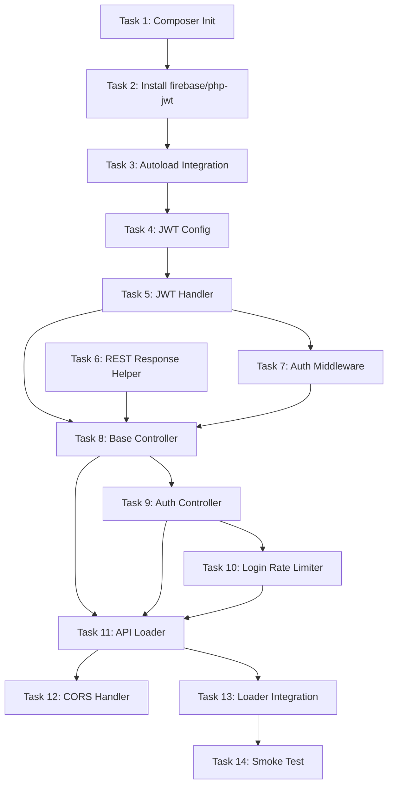

# Phase 1 — API Foundation Build Plan

> [!NOTE]
> This document expands Steps 1–8 from [API_IMPLEMENTATION_PLAN.md](file:///c:/Users/FaisalDev/Desktop/MDCAT/mdcat-platform/docs/API_IMPLEMENTATION_PLAN.md) into atomic, ordered tasks. Each task produces exactly one file (or one change). No task is started until its dependencies are complete. No code is written in this document — only specifications.

---

## Overview

Phase 1 builds the infrastructure that **every future controller depends on**. After Phase 1 is complete, the system can:

1. Accept `POST /wp-json/mdcat/v1/auth/login` and return a JWT
2. Accept `POST /wp-json/mdcat/v1/auth/refresh` and rotate tokens
3. Accept `GET /wp-json/mdcat/v1/auth/me` with a Bearer token and return user data
4. Reject requests with missing, expired, or tampered tokens (401)
5. Reject requests from suspended students (403)
6. Return consistent JSON envelopes for success and error responses
7. Handle CORS preflight from the Next.js origin

Once this foundation is deployed, all subsequent phases (content, dashboard, quiz, etc.) only need to create a controller file and register its routes.

---

## Dependency Graph



---

## File Inventory

Every file created in Phase 1, in final directory order:

```
api/
├── class-api-loader.php                         ← Task 11
├── auth/
│   ├── class-jwt-config.php                     ← Task 4
│   └── class-jwt-handler.php                    ← Task 5
├── middleware/
│   ├── class-rest-auth-middleware.php            ← Task 7
│   └── class-rest-cors-handler.php              ← Task 12
├── controllers/
│   ├── class-rest-base-controller.php           ← Task 8
│   └── class-rest-auth-controller.php           ← Task 9
└── responses/
    └── class-rest-response.php                  ← Task 6

Modified:
├── mdcat-platform.php                           ← Task 3 (add Composer autoload)
└── includes/class-loader.php                    ← Task 13 (add API loader init)

Created at project root:
├── composer.json                                ← Task 1
└── vendor/                                      ← Task 2 (auto-generated)
```

**Total: 8 new PHP files, 2 modified files, 1 new config file**

---

## Tasks

---

### Task 1 — Initialize Composer

| | |
|---|---|
| **File** | `composer.json` (project root) |
| **Location** | `c:\Users\FaisalDev\Desktop\MDCAT\mdcat-platform\composer.json` |
| **Depends On** | Nothing |
| **Purpose** | Initialize Composer in the plugin so we can manage PHP dependencies |

**What to create:**

A minimal `composer.json` at the plugin root with:

- `name`: `faisal-dev-hub/mdcat-platform`
- `description`: `MDCAT Learning Platform WordPress Plugin`
- `type`: `wordpress-plugin`
- `require`: empty (filled in Task 2)
- `config.vendor-dir`: `vendor` (default)

**Why Composer?**

The `firebase/php-jwt` library is the industry standard for JWT in PHP. Installing it via Composer avoids maintaining a manual copy and provides autoloading. WordPress plugins commonly use Composer for third-party dependencies (WooCommerce, Yoast, etc.).

**Acceptance:**

- `composer.json` exists at the plugin root
- Running `composer validate` shows no errors

---

### Task 2 — Install firebase/php-jwt

| | |
|---|---|
| **File** | `vendor/` directory (auto-generated) |
| **Location** | `c:\Users\FaisalDev\Desktop\MDCAT\mdcat-platform\vendor\` |
| **Depends On** | Task 1 |
| **Purpose** | Install the JWT library that handles token encoding, decoding, and signature verification |

**What to do:**

Run `composer require firebase/php-jwt` in the plugin root.

This creates:
- `vendor/firebase/php-jwt/` — the library
- `vendor/autoload.php` — the Composer autoloader

**Version:** Latest stable (currently `^6.0`). This version provides:
- `Firebase\JWT\JWT::encode()` — sign and create tokens
- `Firebase\JWT\JWT::decode()` — verify signature and decode tokens
- `Firebase\JWT\Key` — key wrapper for algorithm specification
- Automatic `ExpiredException` for expired tokens
- Automatic `SignatureInvalidException` for tampered tokens

**Acceptance:**

- `vendor/firebase/php-jwt/src/JWT.php` exists
- `vendor/autoload.php` exists
- `composer.lock` is generated

---

### Task 3 — Integrate Composer Autoload

| | |
|---|---|
| **File** | `mdcat-platform.php` (modify) |
| **Location** | [mdcat-platform.php](file:///c:/Users/FaisalDev/Desktop/MDCAT/mdcat-platform/mdcat-platform.php) |
| **Depends On** | Task 2 |
| **Purpose** | Load the Composer autoloader so `Firebase\JWT\JWT` is available globally |

**What to change:**

Add a single `require_once` line **before** the existing `require_once` for `class-loader.php`:

```
Line to add (after constants, before Load Core Files):

require_once MDCAT_PLATFORM_PATH . 'vendor/autoload.php';
```

**Placement rationale:**

The autoloader must load before any class that uses JWT. Since [class-loader.php](file:///c:/Users/FaisalDev/Desktop/MDCAT/mdcat-platform/includes/class-loader.php) bootstraps all modules, the autoloader must come before it.

**Safety:**

Add a `file_exists()` guard so the plugin does not fatal-error if `vendor/` is missing (e.g., fresh clone without `composer install`):

```
if (file_exists(MDCAT_PLATFORM_PATH . 'vendor/autoload.php')) {
    require_once MDCAT_PLATFORM_PATH . 'vendor/autoload.php';
}
```

**Acceptance:**

- Plugin activates without errors
- `class_exists('Firebase\JWT\JWT')` returns `true` after plugin loads
- Existing AJAX endpoints continue to work (no regression)

---

### Task 4 — JWT Config

| | |
|---|---|
| **File** | `api/auth/class-jwt-config.php` |
| **Location** | `c:\Users\FaisalDev\Desktop\MDCAT\mdcat-platform\api\auth\class-jwt-config.php` |
| **Class** | `MDCAT_Platform_JWT_Config` |
| **Depends On** | Task 3 |
| **Purpose** | Centralize all JWT configuration as named constants |

**Class design:**

A static-only class with no methods — just constants:

| Constant | Value | Rationale |
|----------|-------|-----------|
| `SECRET_KEY` | `AUTH_KEY` from `wp-config.php` | Already unique per WordPress installation; no new secret needed |
| `ALGORITHM` | `'HS256'` | HMAC-SHA256 — standard for same-server JWT |
| `ACCESS_TOKEN_EXPIRY` | `86400` (24 hours in seconds) | Long enough for a study session; short enough to limit stolen token risk |
| `REFRESH_TOKEN_EXPIRY` | `2592000` (30 days in seconds) | Students shouldn't need to re-login for a month |
| `ISSUER` | `get_bloginfo('url')` | The WordPress site URL — validates token origin |
| `TOKEN_TYPE_ACCESS` | `'access'` | Claim value to distinguish access vs refresh tokens |
| `TOKEN_TYPE_REFRESH` | `'refresh'` | Claim value to distinguish access vs refresh tokens |

**Why use `AUTH_KEY`?**

WordPress defines `AUTH_KEY` in `wp-config.php` during installation. It is:
- Unique per site (randomly generated)
- Already used for cookie signing
- Never exposed to the frontend
- Available via the `AUTH_KEY` PHP constant

Using it avoids requiring the admin to configure a separate JWT secret.

**Acceptance:**

- Class loads without errors
- `MDCAT_Platform_JWT_Config::SECRET_KEY` returns a non-empty string
- `MDCAT_Platform_JWT_Config::ALGORITHM` returns `'HS256'`

---

### Task 5 — JWT Handler

| | |
|---|---|
| **File** | `api/auth/class-jwt-handler.php` |
| **Location** | `c:\Users\FaisalDev\Desktop\MDCAT\mdcat-platform\api\auth\class-jwt-handler.php` |
| **Class** | `MDCAT_Platform_JWT_Handler` |
| **Depends On** | Task 4 |
| **Purpose** | Encode, decode, and validate JWT tokens |

**Methods:**

| Method | Signature | Returns | Purpose |
|--------|-----------|---------|---------|
| `generate_access_token` | `( int $user_id, string $email )` | `string` (JWT) | Create a signed access token with 24h expiry |
| `generate_refresh_token` | `( int $user_id )` | `string` (JWT) | Create a signed refresh token with 30d expiry |
| `decode_token` | `( string $token )` | `object\|WP_Error` | Decode and validate a JWT; returns payload or WP_Error |
| `validate_access_token` | `( string $token )` | `int\|WP_Error` | Decode, verify type = 'access', return user_id or WP_Error |
| `validate_refresh_token` | `( string $token )` | `int\|WP_Error` | Decode, verify type = 'refresh', return user_id or WP_Error |

**Token payload structure (access):**

```json
{
  "iss": "https://mdcatinsecond.com",
  "iat": 1719187200,
  "exp": 1719273600,
  "sub": 42,
  "type": "access",
  "data": {
    "user_id": 42,
    "email": "student@example.com"
  }
}
```

**Token payload structure (refresh):**

```json
{
  "iss": "https://mdcatinsecond.com",
  "iat": 1719187200,
  "exp": 1721779200,
  "sub": 42,
  "type": "refresh"
}
```

**Error handling in `decode_token`:**

| Exception Caught | WP_Error Code | HTTP Status Hint |
|-----------------|---------------|-----------------|
| `ExpiredException` | `token_expired` | 401 |
| `SignatureInvalidException` | `token_invalid` | 401 |
| `BeforeValidException` | `token_not_valid_yet` | 401 |
| `UnexpectedValueException` | `token_malformed` | 401 |
| Any other `\Exception` | `token_error` | 401 |

**Acceptance:**

- `generate_access_token(42, 'test@test.com')` returns a non-empty string with 3 dot-separated segments
- `validate_access_token()` on a fresh token returns `42`
- `validate_access_token()` on a tampered token returns `WP_Error('token_invalid')`
- `validate_refresh_token()` on an access token returns `WP_Error` (type mismatch)

---

### Task 6 — REST Response Helper

| | |
|---|---|
| **File** | `api/responses/class-rest-response.php` |
| **Location** | `c:\Users\FaisalDev\Desktop\MDCAT\mdcat-platform\api\responses\class-rest-response.php` |
| **Class** | `MDCAT_Platform_REST_Response` |
| **Depends On** | Nothing (independent) |
| **Purpose** | Standardize all REST API responses into a consistent envelope |

**Methods:**

| Method | Signature | Returns | Purpose |
|--------|-----------|---------|---------|
| `success` | `( mixed $data, int $status = 200 )` | `WP_REST_Response` | Wrap data in `{ "success": true, "data": ... }` |
| `error` | `( string $code, string $message, int $status = 400 )` | `WP_REST_Response` | Wrap error in `{ "success": false, "data": { "code": ..., "message": ... } }` |
| `from_wp_error` | `( WP_Error $error, int $status = 400 )` | `WP_REST_Response` | Convert a `WP_Error` into the standard error format |
| `paginated` | `( array $items, int $page, int $per_page, int $total )` | `WP_REST_Response` | Wrap list data with pagination metadata |

**Why a dedicated response class?**

1. Ensures every endpoint uses the same JSON structure — the Next.js frontend can rely on `response.data.success` to branch logic
2. Prevents controllers from building ad-hoc response shapes
3. Matches the existing `wp_send_json_success()` / `wp_send_json_error()` envelope used by AJAX handlers — same contract, different transport

**Response formats:**

Success:
```json
{ "success": true, "data": { "subjects": [...] } }
```

Error:
```json
{ "success": false, "data": { "code": "invalid_user", "message": "A valid user is required." } }
```

Paginated:
```json
{
  "success": true,
  "data": {
    "items": [...],
    "pagination": { "page": 1, "per_page": 20, "total_items": 156, "total_pages": 8 }
  }
}
```

**WP_Error mapping rules:**

| WP_Error Code | HTTP Status |
|---------------|------------|
| `login_required`, `not_logged_in` | 401 |
| `token_expired`, `token_invalid`, `token_malformed` | 401 |
| `account_suspended`, `unauthorized` | 403 |
| `not_found` | 404 |
| `rate_limited` | 429 |
| Everything else | 400 |

The `from_wp_error()` method will contain this mapping table as an internal array so that controllers can simply pass through a `WP_Error` from any service and get the correct HTTP status automatically.

**Acceptance:**

- `MDCAT_Platform_REST_Response::success(['key' => 'value'])` returns a `WP_REST_Response` with status 200
- `MDCAT_Platform_REST_Response::error('bad_input', 'Missing field', 400)` returns a `WP_REST_Response` with status 400
- `MDCAT_Platform_REST_Response::from_wp_error(new WP_Error('login_required', 'Login'))` returns status 401

---

### Task 7 — Auth Middleware

| | |
|---|---|
| **File** | `api/middleware/class-rest-auth-middleware.php` |
| **Location** | `c:\Users\FaisalDev\Desktop\MDCAT\mdcat-platform\api\middleware\class-rest-auth-middleware.php` |
| **Class** | `MDCAT_Platform_REST_Auth_Middleware` |
| **Depends On** | Task 5 (JWT Handler) |
| **Purpose** | Extract JWT from the `Authorization` header and establish WordPress user context |

**Methods:**

| Method | Signature | Returns | Purpose |
|--------|-----------|---------|---------|
| `authenticate` | `( WP_REST_Request $request )` | `int\|WP_Error` | Validates the token and returns the user_id, or WP_Error on failure |
| `get_token_from_header` | `( WP_REST_Request $request )` | `string\|null` | Extracts the Bearer token from the `Authorization` header |
| `set_current_user` | `( int $user_id )` | `true\|WP_Error` | Calls `wp_set_current_user()` and verifies the user exists |

**`authenticate()` execution flow:**

```
1. Call get_token_from_header($request)
2. If null → return WP_Error('missing_token', 'Authorization header is required.') [401]
3. Call JWT_Handler::validate_access_token($token)
4. If WP_Error → return it (expired, tampered, malformed)
5. Call set_current_user($user_id)
6. If WP_Error → return it (user deleted)
7. Return $user_id
```

**`get_token_from_header()` logic:**

```
1. Read $request->get_header('Authorization')
2. If empty → return null
3. Check if string starts with 'Bearer ' (case-insensitive)
4. If not → return null
5. Return substr after 'Bearer '
```

**`set_current_user()` logic:**

```
1. Call wp_set_current_user($user_id)
2. Call get_userdata($user_id)
3. If false → return WP_Error('user_not_found', 'User account no longer exists.') [401]
4. Return true
```

**Why a separate middleware class instead of inline in the base controller?**

- Separation of concerns: token extraction is transport-layer logic, not controller logic
- Testability: the middleware can be tested independently
- Reuse: both the base controller permission callbacks and the auth controller login/refresh use the JWT handler, but only the middleware handles the `Authorization` header extraction

**Acceptance:**

- Given a request with `Authorization: Bearer <valid_token>`, `authenticate()` returns the user ID and `get_current_user_id()` returns the same ID
- Given a request with no header, returns `WP_Error('missing_token')`
- Given a request with `Authorization: Bearer <expired_token>`, returns `WP_Error('token_expired')`
- Given a request with `Authorization: Basic abc123`, returns `null` from `get_token_from_header()`

---

### Task 8 — Base Controller

| | |
|---|---|
| **File** | `api/controllers/class-rest-base-controller.php` |
| **Location** | `c:\Users\FaisalDev\Desktop\MDCAT\mdcat-platform\api\controllers\class-rest-base-controller.php` |
| **Class** | `MDCAT_Platform_REST_Base_Controller` |
| **Depends On** | Tasks 5, 6, 7 |
| **Purpose** | Shared permission callbacks and route registration helper used by all controllers |

**Properties:**

| Property | Type | Value | Purpose |
|----------|------|-------|---------|
| `$namespace` | `string` | `'mdcat/v1'` | REST API namespace for all routes |

**Permission Callback Methods:**

Every method below is a `permission_callback` passed to `register_rest_route()`. Each returns `true` (allow) or `WP_Error` (deny).

| Method | Signature | Logic | Used By |
|--------|-----------|-------|---------|
| `check_public_access` | `( WP_REST_Request $request )` | Always returns `true` | Subjects, chapters, collections, enrollment |
| `check_student_access` | `( WP_REST_Request $request )` | Calls `Auth_Middleware::authenticate()` → if WP_Error, return it → else return `true` | Dashboard, progress, analytics, gamification, notifications, study planner |
| `check_dashboard_access` | `( WP_REST_Request $request )` | `check_student_access()` then `Access_Control_Service::can_access_dashboard($user_id)` | Dashboard |
| `check_quiz_access` | `( WP_REST_Request $request )` | `check_student_access()` then `Access_Control_Service::can_access_quiz($user_id, $collection_id)` | Quiz start |
| `check_analytics_access` | `( WP_REST_Request $request )` | `check_student_access()` then `Access_Control_Service::can_access_analytics($user_id)` | Performance analytics |
| `check_revision_access` | `( WP_REST_Request $request )` | `check_student_access()` then `Access_Control_Service::can_access_revision($user_id)` | Bookmarks, wrong questions |
| `check_gamification_access` | `( WP_REST_Request $request )` | `check_student_access()` then `Access_Control_Service::can_access_streak($user_id)` | Streak, XP, badges, achievements, leaderboard |
| `check_attempt_owner` | `( WP_REST_Request $request )` | `check_student_access()` then load attempt row, verify `user_id === get_current_user_id()` | Quiz questions/answer/complete/result, attempt review |

**How `check_attempt_owner` works:**

```
1. Run check_student_access() — if WP_Error, return it
2. Read attempt_id from $request['id'] (URL parameter)
3. Query: SELECT user_id, collection_id, status FROM wp_mdcat_attempts WHERE id = $attempt_id
4. If no row → return WP_Error('not_found', 'Attempt not found.') [404]
5. If row.user_id !== get_current_user_id() → return WP_Error('forbidden', 'You cannot access this attempt.') [403]
6. Return true
```

**How suspension is enforced (no new code):**

```
check_dashboard_access()
  → calls Access_Control_Service::can_access_dashboard($user_id)
    → internally runs apply_filters('mdcat_can_access_dashboard', true, $user_id)
      → Student_Status_Service::check_suspended_dashboard() is already hooked at priority 20
        → checks get_user_meta($user_id, 'mdcat_account_status')
        → if 'suspended' → returns WP_Error('account_suspended', '...')
  → WP_Error propagates back to permission_callback → HTTP 403
```

This chain already works because the Student_Management module registers its filters in [class-student-management.php::init()](file:///c:/Users/FaisalDev/Desktop/MDCAT/mdcat-platform/modules/student-management/class-student-management.php#L34-L39), which runs during [class-loader.php::init()](file:///c:/Users/FaisalDev/Desktop/MDCAT/mdcat-platform/includes/class-loader.php#L39-L40) — **before** the API loader initializes.

**Acceptance:**

- `check_public_access()` returns `true` regardless of headers
- `check_student_access()` with a valid token returns `true` and sets the WP user
- `check_student_access()` with no token returns `WP_Error`
- `check_dashboard_access()` for a suspended user returns `WP_Error('account_suspended')`
- `check_attempt_owner()` with another user's attempt ID returns `WP_Error('forbidden')`

---

### Task 9 — Auth Controller

| | |
|---|---|
| **File** | `api/controllers/class-rest-auth-controller.php` |
| **Location** | `c:\Users\FaisalDev\Desktop\MDCAT\mdcat-platform\api\controllers\class-rest-auth-controller.php` |
| **Class** | `MDCAT_Platform_REST_Auth_Controller` |
| **Depends On** | Task 8 (Base Controller) |
| **Purpose** | Login, token refresh, and current user profile endpoints |

**Methods and route mapping:**

| Method | HTTP | Route | Permission | Purpose |
|--------|------|-------|------------|---------|
| `register_routes` | — | — | — | Registers all 3 auth routes via `register_rest_route()` |
| `login` | `POST` | `/auth/login` | `check_public_access` | Authenticate student → return JWT pair |
| `refresh` | `POST` | `/auth/refresh` | `check_public_access` | Validate refresh token → return new access token |
| `me` | `GET` | `/auth/me` | `check_student_access` | Return current authenticated user profile |

---

#### `login()` — Detailed Flow

```
1. Read 'email' from $request (sanitize_email)
2. Read 'password' from $request (no sanitization — raw password)
3. Validate: both fields present → else WP_Error('missing_credentials') [400]
4. Call wp_authenticate($email, $password)
5. If WP_Error → return REST_Response::from_wp_error() [401]
6. Check Student_Status_Service::is_suspended($user->ID)
7. If suspended → return REST_Response::error('account_suspended', '...') [403]
8. Generate access token: JWT_Handler::generate_access_token($user->ID, $user->user_email)
9. Generate refresh token: JWT_Handler::generate_refresh_token($user->ID)
10. Return REST_Response::success({
      token: <access_token>,
      refresh_token: <refresh_token>,
      expires_in: JWT_Config::ACCESS_TOKEN_EXPIRY,
      user: {
        id: $user->ID,
        display_name: $user->display_name,
        email: $user->user_email,
        registered_at: $user->user_registered
      }
    })
```

**Why check suspension at login?**

The Access_Control_Service filters check suspension per-feature (quiz, dashboard, etc.). But a suspended student should not receive a token at all — checking at login provides immediate feedback and prevents unnecessary token generation.

---

#### `refresh()` — Detailed Flow

```
1. Read 'refresh_token' from $request body
2. Validate: field present → else WP_Error('missing_token') [400]
3. Call JWT_Handler::validate_refresh_token($refresh_token)
4. If WP_Error → return REST_Response::from_wp_error() [401]
5. $user_id = decoded result
6. Verify user exists: get_userdata($user_id) → if false → WP_Error('user_not_found') [401]
7. Check Student_Status_Service::is_suspended($user_id)
8. If suspended → return REST_Response::error('account_suspended', '...') [403]
9. Generate new access token: JWT_Handler::generate_access_token($user_id, $user->user_email)
10. Return REST_Response::success({
      token: <new_access_token>,
      expires_in: JWT_Config::ACCESS_TOKEN_EXPIRY
    })
```

> [!NOTE]
> The refresh endpoint does **not** rotate the refresh token itself. The existing refresh token remains valid until its 30-day expiry. This simplifies the client implementation — no need to store a new refresh token on every refresh.

---

#### `me()` — Detailed Flow

```
1. $user_id = get_current_user_id()  (already set by permission_callback)
2. $user = get_userdata($user_id)
3. $is_suspended = Student_Status_Service::is_suspended($user_id)
4. Return REST_Response::success({
      id: $user->ID,
      display_name: $user->display_name,
      email: $user->user_email,
      registered_at: $user->user_registered,
      is_suspended: $is_suspended
    })
```

**Argument validation (register_rest_route args):**

| Endpoint | Parameter | Type | Required | Sanitize |
|----------|-----------|------|----------|----------|
| `login` | `email` | `string` | Yes | `sanitize_email` |
| `login` | `password` | `string` | Yes | none (raw) |
| `refresh` | `refresh_token` | `string` | Yes | `sanitize_text_field` |

**Acceptance:**

- `POST /auth/login` with valid email + password → 200 with `token` and `refresh_token`
- `POST /auth/login` with wrong password → 401
- `POST /auth/login` for suspended user → 403
- `POST /auth/login` with missing email → 400
- `POST /auth/refresh` with valid refresh token → 200 with new `token`
- `POST /auth/refresh` with expired refresh token → 401
- `POST /auth/refresh` with an access token (type mismatch) → 401
- `GET /auth/me` with valid Bearer token → 200 with user data
- `GET /auth/me` with no token → 401

---

### Task 10 — Login Rate Limiter

| | |
|---|---|
| **Integration Point** | Inside `Auth_Controller::login()` (added to Task 9's flow) |
| **Depends On** | Task 9 |
| **Purpose** | Prevent brute-force password attacks on the login endpoint |

**Rate limiting rules:**

| Scope | Key Pattern | Limit | Window | Response |
|-------|------------|-------|--------|----------|
| Per email | `mdcat_login_email_{md5(email)}` | 5 failed attempts | 15 minutes | 429 `too_many_attempts` |
| Per IP | `mdcat_login_ip_{md5(ip)}` | 20 attempts (pass or fail) | 1 hour | 429 `rate_limited` |

**Implementation approach:**

Uses WordPress transients — the same mechanism used by [Enrollment_Ajax::handle_submit()](file:///c:/Users/FaisalDev/Desktop/MDCAT/mdcat-platform/modules/enrollment/ajax/class-enrollment-ajax.php#L46-L52) for enrollment rate limiting:

```
1. Before wp_authenticate():
   a. $ip = get client IP (same method as Enrollment_Ajax::get_client_ip())
   b. $ip_key = 'mdcat_login_ip_' . md5($ip)
   c. $ip_attempts = get_transient($ip_key)
   d. If $ip_attempts >= 20 → return 429

2. $email_key = 'mdcat_login_email_' . md5($email)
   $email_failures = get_transient($email_key)
   If $email_failures >= 5 → return 429

3. Call wp_authenticate()

4. If authentication failed:
   a. Increment email failure counter: set_transient($email_key, $email_failures + 1, 15 * MINUTE_IN_SECONDS)

5. Always increment IP counter: set_transient($ip_key, $ip_attempts + 1, HOUR_IN_SECONDS)
```

**IP extraction method:**

Reuse the same pattern from [Enrollment_Ajax::get_client_ip()](file:///c:/Users/FaisalDev/Desktop/MDCAT/mdcat-platform/modules/enrollment/ajax/class-enrollment-ajax.php#L368-L380):
- Check `HTTP_X_FORWARDED_FOR` first (for reverse proxies)
- Fall back to `REMOTE_ADDR`
- Default to `127.0.0.1`

**Acceptance:**

- 5th failed login for same email within 15 min → 429
- 6th login attempt succeeds if previous failures were > 15 min ago
- 20th request from same IP within 1 hour → 429 (regardless of email or success)

---

### Task 11 — API Loader

| | |
|---|---|
| **File** | `api/class-api-loader.php` |
| **Location** | `c:\Users\FaisalDev\Desktop\MDCAT\mdcat-platform\api\class-api-loader.php` |
| **Class** | `MDCAT_Platform_API_Loader` |
| **Depends On** | Tasks 7, 8, 9 |
| **Purpose** | Bootstrap the entire REST API layer — load files and register routes |

**Methods:**

| Method | Purpose |
|--------|---------|
| `init()` | Called from `class-loader.php`. Hooks `register_routes` to `rest_api_init` |
| `load_dependencies()` | Loads all API PHP files via `require_once` |
| `register_routes()` | Calls `register_routes()` on each controller class |

**`load_dependencies()` — File loading order:**

```
1. api/auth/class-jwt-config.php
2. api/auth/class-jwt-handler.php
3. api/middleware/class-rest-auth-middleware.php
4. api/middleware/class-rest-cors-handler.php
5. api/responses/class-rest-response.php
6. api/controllers/class-rest-base-controller.php
7. api/controllers/class-rest-auth-controller.php
```

**`register_routes()` — Controller registration:**

```
MDCAT_Platform_REST_Auth_Controller::register_routes();
```

Future phases add controllers here:
```
MDCAT_Platform_REST_Subjects_Controller::register_routes();
MDCAT_Platform_REST_Dashboard_Controller::register_routes();
// etc.
```

**`init()` — Hook registration:**

```
add_action('rest_api_init', [__CLASS__, 'register_routes']);
```

**Why `rest_api_init`?**

WordPress fires `rest_api_init` only when a REST API request is being served. This means:
- Controller classes are not loaded on regular page views
- No performance impact on the existing frontend
- Route registration happens at the correct lifecycle point

**Acceptance:**

- `GET /wp-json/mdcat/v1` shows the auth routes in the WordPress REST API index
- All 3 auth endpoints are reachable (even if they return errors for missing parameters)
- Regular WordPress admin and frontend pages load at the same speed (no regression)

---

### Task 12 — CORS Handler

| | |
|---|---|
| **File** | `api/middleware/class-rest-cors-handler.php` |
| **Location** | `c:\Users\FaisalDev\Desktop\MDCAT\mdcat-platform\api\middleware\class-rest-cors-handler.php` |
| **Class** | `MDCAT_Platform_REST_CORS_Handler` |
| **Depends On** | Task 11 (API Loader calls it) |
| **Purpose** | Allow cross-origin requests from the Next.js frontend |

**Methods:**

| Method | Purpose |
|--------|---------|
| `init()` | Hooks into `rest_pre_serve_request` to add CORS headers |
| `add_cors_headers()` | Adds `Access-Control-Allow-*` headers to REST responses |
| `handle_preflight()` | Returns an empty 200 response for OPTIONS preflight requests |

**CORS headers to set:**

| Header | Value | Notes |
|--------|-------|-------|
| `Access-Control-Allow-Origin` | Configurable origin (see below) | Not `*` — specific domain |
| `Access-Control-Allow-Methods` | `GET, POST, OPTIONS` | Only methods the API uses |
| `Access-Control-Allow-Headers` | `Authorization, Content-Type` | Bearer token + JSON body |
| `Access-Control-Allow-Credentials` | `true` | Required for `httpOnly` cookie refresh tokens |
| `Access-Control-Max-Age` | `86400` | Cache preflight for 24 hours |

**Origin configuration:**

The allowed origin is read from a WordPress option or falls back to a filterable default:

```
1. Check get_option('mdcat_cors_origin') → stored in wp_options
2. If empty → apply_filters('mdcat_api_cors_origin', '')
3. If still empty → allow no cross-origin requests (security default)
```

For development, the origin can be temporarily set to `http://localhost:3000` (Next.js dev server).
For production, it will be the Vercel deployment URL.

**Preflight handling:**

WordPress does not natively handle `OPTIONS` preflight requests for custom namespaces. The CORS handler must:
1. Hook into `rest_pre_serve_request`
2. If request method is `OPTIONS`, send headers and `exit` with 200

**Acceptance:**

- `OPTIONS /wp-json/mdcat/v1/auth/login` from `http://localhost:3000` returns 200 with correct CORS headers
- `POST /wp-json/mdcat/v1/auth/login` from `http://localhost:3000` includes `Access-Control-Allow-Origin` in response
- Requests from unlisted origins do **not** receive CORS headers (blocked by browser)

---

### Task 13 — Loader Integration

| | |
|---|---|
| **File** | `includes/class-loader.php` (modify) |
| **Location** | [class-loader.php](file:///c:/Users/FaisalDev/Desktop/MDCAT/mdcat-platform/includes/class-loader.php) |
| **Depends On** | Task 11 |
| **Purpose** | Add the API loader to the plugin bootstrap sequence |

**What to change:**

Add 2 lines at the **end** of `MDCAT_Platform_Loader::init()`, after the frontend initialization (line 92):

```
require_once MDCAT_PLATFORM_PATH . 'api/class-api-loader.php';
MDCAT_Platform_API_Loader::init();
```

**Placement rationale:**

The API loader must be the **last thing** initialized because:
1. All module services must be loaded first (Quiz_Engine, Dashboard_Service, etc.)
2. All WordPress filter hooks must be registered first (suspension filters, access filters)
3. The API layer is a consumer of existing services — it must not initialize before its dependencies

**Acceptance:**

- Plugin loads without errors
- Existing AJAX endpoints still work
- `GET /wp-json/mdcat/v1/auth/me` returns a response (401 without token, 200 with valid token)

---

### Task 14 — Smoke Test

| | |
|---|---|
| **Depends On** | Task 13 (everything) |
| **Purpose** | Verify the complete Phase 1 stack works end-to-end |

**Test sequence:**

```
Test 1: REST API Discovery
  → GET /wp-json/mdcat/v1
  → Expect: 200 with route index showing /auth/login, /auth/refresh, /auth/me

Test 2: Login Success
  → POST /wp-json/mdcat/v1/auth/login { email, password }
  → Expect: 200 with { success: true, data: { token, refresh_token, user } }

Test 3: Login Failure
  → POST /wp-json/mdcat/v1/auth/login { email, wrong_password }
  → Expect: 401 with { success: false, data: { code: "...", message: "..." } }

Test 4: Login Missing Fields
  → POST /wp-json/mdcat/v1/auth/login { }
  → Expect: 400

Test 5: Auth Me with Valid Token
  → GET /wp-json/mdcat/v1/auth/me
  → Headers: Authorization: Bearer <token_from_test_2>
  → Expect: 200 with user data

Test 6: Auth Me without Token
  → GET /wp-json/mdcat/v1/auth/me
  → Expect: 401

Test 7: Auth Me with Expired Token
  → GET /wp-json/mdcat/v1/auth/me
  → Headers: Authorization: Bearer <manually_crafted_expired_token>
  → Expect: 401 with code "token_expired"

Test 8: Token Refresh
  → POST /wp-json/mdcat/v1/auth/refresh { refresh_token: <from_test_2> }
  → Expect: 200 with new token

Test 9: Refresh with Access Token (type mismatch)
  → POST /wp-json/mdcat/v1/auth/refresh { refresh_token: <access_token_from_test_2> }
  → Expect: 401

Test 10: Suspended User Login
  → POST /wp-json/mdcat/v1/auth/login { suspended_user_email, password }
  → Expect: 403 with code "account_suspended"

Test 11: CORS Preflight
  → OPTIONS /wp-json/mdcat/v1/auth/login
  → Origin: http://localhost:3000
  → Expect: 200 with Access-Control-Allow-Origin header

Test 12: Rate Limiting
  → POST /wp-json/mdcat/v1/auth/login with wrong password × 6
  → Expect: 5th attempt succeeds (returns 401), 6th returns 429
```

---

## Execution Summary

| # | Task | File | Type | Effort |
|---|------|------|------|--------|
| 1 | Composer Init | `composer.json` | Create | 10 min |
| 2 | Install JWT library | `vendor/` | Command | 5 min |
| 3 | Autoload Integration | `mdcat-platform.php` | Modify (1 line) | 10 min |
| 4 | JWT Config | `api/auth/class-jwt-config.php` | Create | 20 min |
| 5 | JWT Handler | `api/auth/class-jwt-handler.php` | Create | 45 min |
| 6 | REST Response Helper | `api/responses/class-rest-response.php` | Create | 30 min |
| 7 | Auth Middleware | `api/middleware/class-rest-auth-middleware.php` | Create | 30 min |
| 8 | Base Controller | `api/controllers/class-rest-base-controller.php` | Create | 45 min |
| 9 | Auth Controller | `api/controllers/class-rest-auth-controller.php` | Create | 60 min |
| 10 | Login Rate Limiter | Inside Auth Controller | Inline | 20 min |
| 11 | API Loader | `api/class-api-loader.php` | Create | 30 min |
| 12 | CORS Handler | `api/middleware/class-rest-cors-handler.php` | Create | 30 min |
| 13 | Loader Integration | `includes/class-loader.php` | Modify (2 lines) | 5 min |
| 14 | Smoke Test | — | Manual test | 30 min |
| | **Total** | **8 new + 2 modified** | | **~6 hours** |
